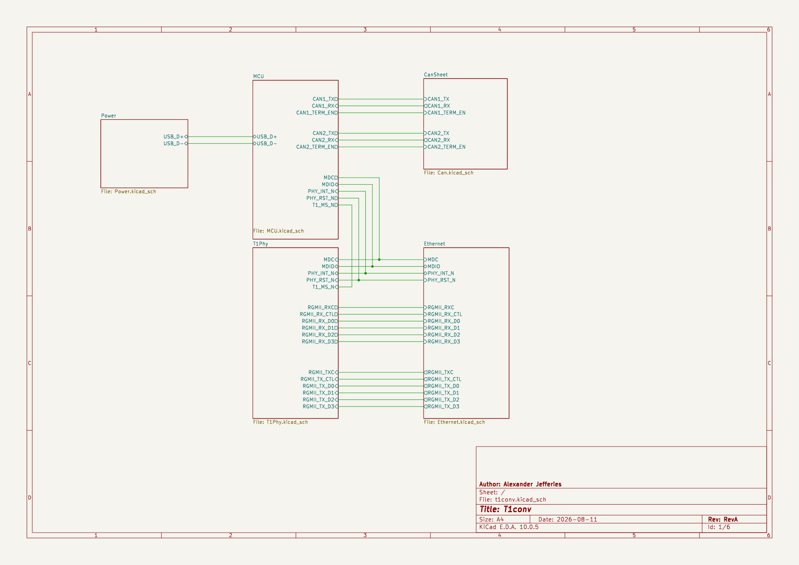
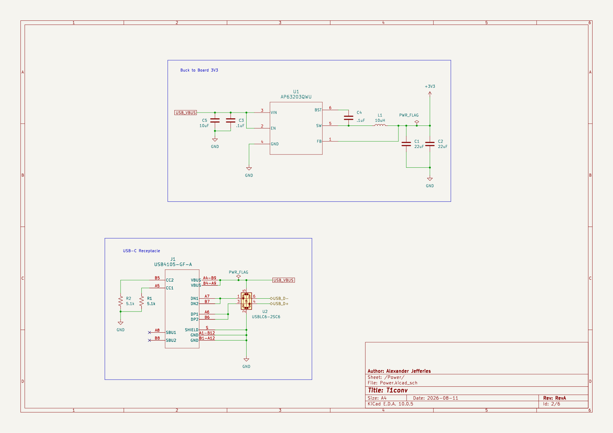
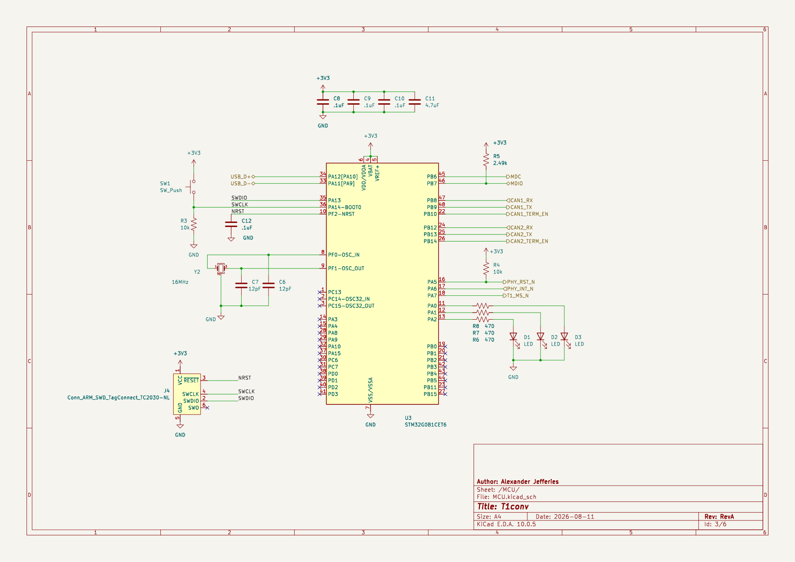
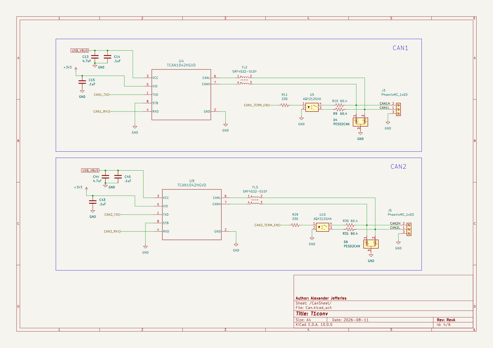
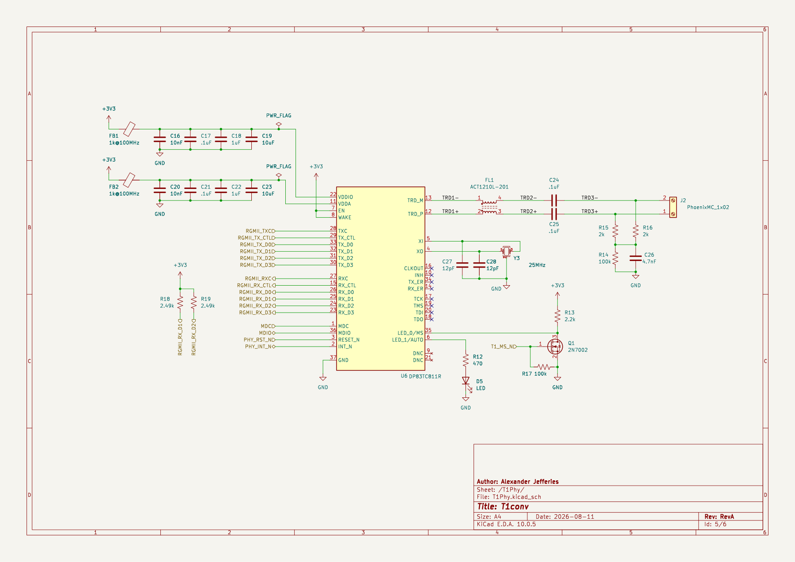
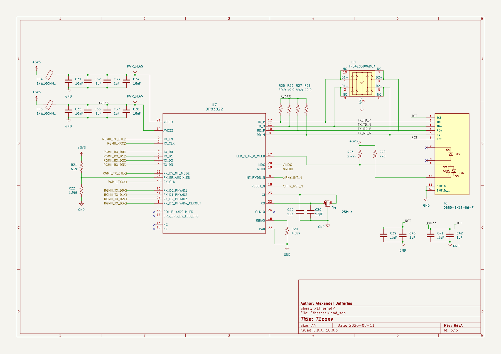

# t1conv

Current Progress: Finished schematics, workinf on layout
100BASE-T1 ↔ 100BASE-TX media converter + dual CAN FD/USB adapter on one
board.

## Features

- Wire-speed T1↔TX conversion, PHY-to-PHY (DP83TC811 ↔ DP83822 over RGMII).
  No MAC, no firmware in the data path, converts with the MCU in reset.
- Two independent CAN FD channels over USB, using the gs_usb protocol:
  works out of the box with SocketCAN, python-can, and SavvyCAN.
- Software-switchable termination on each CAN channel (PhotoMOS; for example,
  `ip link set can0 type can termination 120`).
- Software-selectable T1 master/slave: FET on the strap pin, resampled by
  PHY reset. Boards are identical; role is a console command.
- Powered and flashed over USB-C. Blank MCU enumerates in DFU; BOOT button
  for recovery; SWD pads as last resort.

## Info

- Transformerless T1 MDI: TI-validated CMC, CM termination matched to that
  specific choke, 2 kV coupling network, 100 Ω differential on both MDI sides.
- Back-to-back RGMII delay budget: 25 MHz SDR at 100M, TX+RX internal delay
  strapped in the T1 PHY, strap tables derived from SNLA292/SNLU231.

## Schematics

The images below are exported from the current KiCad hierarchy.

### Top level

### Power

### MCU

### Dual CAN FD

### 100BASE-T1 PHY

### 100BASE-TX Ethernet PHY

